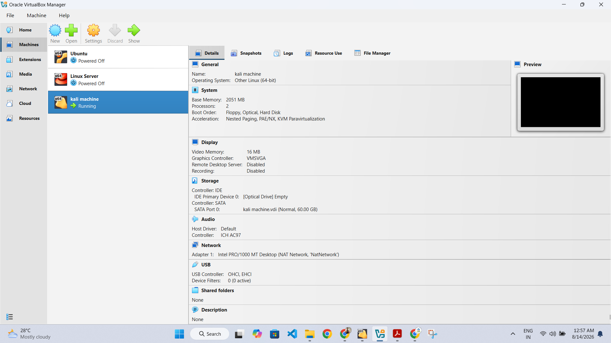

# 🔐 Cybersecurity Lab Environment Setup

### Networkwalks Cybersecurity Program — Batch B082

**Week 1 Project | VirtualBox | Kali Linux | Virtual Networking**

---

## 📌 Project Overview

This project focuses on building and configuring a **virtual cybersecurity laboratory environment** using **Oracle VirtualBox and Kali Linux**.

The objective of this lab is to create a controlled and isolated environment that can be used for cybersecurity learning, networking practice, Linux administration, security testing, and future penetration-testing exercises.

As part of this project, I configured a Kali Linux virtual machine, created a dedicated NAT Network, configured a static IPv4 address, verified network connectivity, tested DNS resolution, and prepared the virtual machine for future cybersecurity activities.

---

## 🎯 Project Objectives

The main objectives of this Week 1 project were:

* Install and configure Oracle VirtualBox
* Set up a Kali Linux virtual machine
* Create a dedicated private NAT Network
* Configure the Kali Linux network interface
* Assign and verify an IPv4 address
* Configure the default gateway and DNS server
* Test network and Internet connectivity
* Verify DNS resolution
* Explore the Kali Linux cybersecurity tool environment
* Document the complete laboratory setup

---

## 🛠️ Technologies & Tools

| Technology / Tool       | Purpose                                                |
| ----------------------- | ------------------------------------------------------ |
| **Oracle VirtualBox**   | Virtualization platform                                |
| **Kali Linux**          | Cybersecurity and penetration-testing operating system |
| **NAT Network**         | Private virtual network connectivity                   |
| **NetworkManager**      | Linux network configuration                            |
| **IPv4**                | Network addressing                                     |
| **Ping**                | Network connectivity testing                           |
| **DNS**                 | Domain name resolution                                 |
| **Kali Security Tools** | Cybersecurity learning and testing                     |

---

# 🏗️ Lab Environment

| Component                | Configuration                     |
| ------------------------ | --------------------------------- |
| **Host OS**              | Windows 11                        |
| **Hypervisor**           | Oracle VirtualBox                 |
| **Security OS**          | Kali Linux                        |
| **Virtual Machine Name** | `kali machine`                    |
| **Virtual Network**      | NAT Network (`NatNetwork`)        |
| **Network Adapter**      | Intel PRO/1000 MT Desktop         |
| **Network Address**      | `10.0.0.0/24`                     |
| **Subnet Mask**          | `255.255.255.0`                   |
| **Kali IP Address**      | `10.0.0.2`                        |
| **Default Gateway**      | `10.0.0.1`                        |
| **DNS Server**           | `8.8.8.8`                         |
| **IPv4 Configuration**   | Manual / Static                   |
| **DHCP**                 | Enabled on VirtualBox NAT Network |
| **IPv6**                 | Disabled                          |
| **Allocated RAM**        | 2051 MB                           |
| **Virtual Processors**   | 2                                 |
| **Virtual Disk**         | 60 GB                             |
| **Graphics Controller**  | VMSVGA                            |

---

# 🌐 Lab Network Architecture

The virtual laboratory uses a dedicated NAT Network with the following configuration:

```text
                         Internet
                            │
                            ▼
                    Oracle VirtualBox
                            │
                            ▼
                     NAT Network
                     NatNetwork
                     10.0.0.0/24
                            │
                     Gateway: 10.0.0.1
                            │
                            ▼
                    ┌────────────────┐
                    │  Kali Linux VM │
                    │                │
                    │ IP: 10.0.0.2   │
                    │ /24            │
                    │ DNS: 8.8.8.8   │
                    └────────────────┘
```

### Network Summary

```text
Network        : 10.0.0.0/24
Subnet Mask    : 255.255.255.0
Kali IP        : 10.0.0.2
Gateway        : 10.0.0.1
DNS            : 8.8.8.8
Network Type   : NAT Network
Network Name   : NatNetwork
```

---

# ⚙️ Lab Setup & Configuration

## 1️⃣ Oracle VirtualBox & Kali Linux VM

Oracle VirtualBox was used as the virtualization platform for the cybersecurity laboratory.

A Kali Linux virtual machine named **`kali machine`** was configured with:

* 2 virtual processors
* 2051 MB RAM
* 60 GB virtual disk
* VMSVGA graphics controller
* Intel PRO/1000 MT virtual network adapter
* NAT Network connectivity

### Screenshot



### Result

**Status: ✅ Completed**

---

# 2️⃣ Kali Linux Environment

The Kali Linux virtual machine was successfully started and verified.

Kali Linux provides a comprehensive collection of cybersecurity and penetration-testing tools that will be used in future laboratory exercises.

The environment was prepared as a controlled virtual machine for cybersecurity learning and authorized testing.

### Screenshot


### Result

**Status: ✅ Completed**

---

# 3️⃣ Kali Linux IPv4 Configuration

The Kali Linux network interface was configured using a **manual IPv4 configuration**.

The configured parameters were:

```text
IPv4 Method     : Manual
IP Address      : 10.0.0.2
Netmask         : /24
Subnet Mask     : 255.255.255.0
Gateway         : 10.0.0.1
DNS Server      : 8.8.8.8
```

The configuration was performed through the Kali Linux network settings.

### Screenshot


### Result

**Status: ✅ Completed**

---

# 4️⃣ NAT Network Configuration

A dedicated NAT Network named **`NatNetwork`** was configured in Oracle VirtualBox.

The network was configured with:

```text
Network Name : NatNetwork
IPv4 Prefix  : 10.0.0.0/24
DHCP         : Enabled
IPv6         : Disabled
```

This provides a private virtual network environment for the Kali Linux laboratory.

### Screenshot


### Result

**Status: ✅ Completed**

---

# 5️⃣ Network Connectivity Test

After configuring the network, connectivity from Kali Linux was verified.

The following command was used:

```bash
ping google.com
```

The successful ICMP responses confirmed that the Kali Linux virtual machine had working network and Internet connectivity.

### Screenshot


### Result

**Status: ✅ Connectivity Verified**

---

# 6️⃣ Kali Linux Security Tools

The Kali Linux application menu was explored to verify the availability of the built-in cybersecurity toolset.

The environment includes tools covering areas such as:

* Reconnaissance
* Resource Development
* Initial Access
* Execution
* Persistence
* Privilege Escalation
* Defense Evasion
* Credential Access
* Discovery
* Lateral Movement
* Collection
* Command and Control
* Exfiltration
* Impact
* Forensics

These tools will be explored in greater detail during subsequent cybersecurity laboratory exercises.

### Screenshot


### Result

**Status: ✅ Environment Verified**

---

# 🔎 Verification

The following verification activities were completed during the lab setup:

### ✅ Virtual Machine Verification

The Kali Linux virtual machine was successfully configured and started in Oracle VirtualBox.

### ✅ Network Configuration Verification

The Kali Linux system was configured with:

```text
IP Address : 10.0.0.2
Gateway    : 10.0.0.1
DNS        : 8.8.8.8
```

### ✅ NAT Network Verification

The VirtualBox NAT Network was configured as:

```text
NatNetwork
10.0.0.0/24
DHCP Enabled
```

### ✅ Connectivity Verification

Internet connectivity was successfully tested using:

```bash
ping google.com
```

Successful responses confirmed network connectivity.

---

# 📚 Commands Used

The following commands are useful for verifying the network configuration:

### Check IP Address

```bash
ip a
```

### Check Routing Table

```bash
ip route
```

### Test Gateway Connectivity

```bash
ping -c 4 10.0.0.1
```

### Test Internet Connectivity

```bash
ping -c 4 google.com
```

### Test DNS Resolution

```bash
nslookup google.com
```

---

# 💡 Key Learnings

Through this project, I gained practical experience in:

* Virtual machine deployment
* Oracle VirtualBox configuration
* Kali Linux environment setup
* Virtual networking
* NAT Network configuration
* IPv4 addressing
* Static IP configuration
* Subnet masks and CIDR notation
* Default gateway configuration
* DNS configuration
* Network connectivity testing
* DNS resolution
* Linux network configuration
* Cybersecurity tool categorization
* Technical documentation

---

# 🧠 Technical Concepts Learned

### NAT Network

A NAT Network allows multiple virtual machines to communicate through a private virtual network while providing connectivity to external networks.

### Static IPv4 Configuration

The Kali Linux machine was manually configured with:

```text
IP      : 10.0.0.2
Mask    : 255.255.255.0
Gateway : 10.0.0.1
DNS     : 8.8.8.8
```

### CIDR

The network:

```text
10.0.0.0/24
```

corresponds to:

```text
Subnet Mask: 255.255.255.0
```

### DNS

The DNS server `8.8.8.8` was configured to resolve domain names such as:

```text
google.com
```

into their corresponding IP addresses.

---

# 📸 Project Screenshots

All screenshots included in this repository are from my own Week 1 cybersecurity laboratory setup.

### VirtualBox Kali VM


### Kali Linux Environment


### IPv4 Network Configuration


### NAT Network


### Connectivity Test


### Kali Security Tools


---

# 🔐 Security & Ethics

This laboratory has been created strictly for **educational purposes and authorized cybersecurity testing**.

All security testing, scanning, exploitation, or other security activities should only be performed against systems, applications, networks, or devices that are owned by me or for which I have explicit authorization.

The virtual laboratory provides a controlled environment for practicing cybersecurity concepts safely.

---

# 🎥 Project Demonstration

A short video demonstration of the completed laboratory setup is included with the corresponding project submission.

The demonstration covers:

* Oracle VirtualBox configuration
* Kali Linux virtual machine
* NAT Network configuration
* IPv4 configuration
* Network connectivity verification
* Kali Linux cybersecurity environment

---

# 📊 Week 1 Project Status

| Task                                   | Status      |
| -------------------------------------- | ----------- |
| Oracle VirtualBox Setup                | ✅ Completed |
| Kali Linux VM Setup                    | ✅ Completed |
| NAT Network Configuration              | ✅ Completed |
| IPv4 Configuration                     | ✅ Completed |
| Gateway Configuration                  | ✅ Completed |
| DNS Configuration                      | ✅ Completed |
| Network Connectivity Test              | ✅ Completed |
| Kali Security Environment Verification | ✅ Completed |
| Technical Documentation                | ✅ Completed |

## 🎉 Week 1 Project — Completed Successfully

---

# 👨‍🏫 Training & Acknowledgement

**Cybersecurity Program — Networkwalks**

**Batch:** B082
**Project:** Week 1 — Cybersecurity & Penetration Testing Lab Setup

Special thanks to **Waqas Karim (CCIE)** and the **Networkwalks team** for their valuable guidance, practical training, and support throughout the learning process.

---

## 🚀 Next Steps

This laboratory environment will serve as the foundation for future cybersecurity exercises involving:

* Networking fundamentals
* Linux administration
* Reconnaissance
* Vulnerability assessment
* Penetration testing
* Web security
* Security monitoring
* Defensive security concepts

---

**#Networkwalks #Cybersecurity #KaliLinux #VirtualBox #PenetrationTesting #Networking #CyberSecurityLab #Linux #CyberSecurityLearning**
